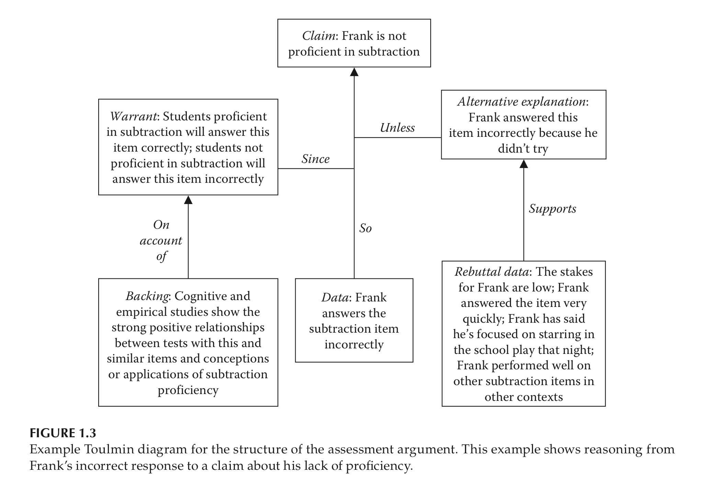
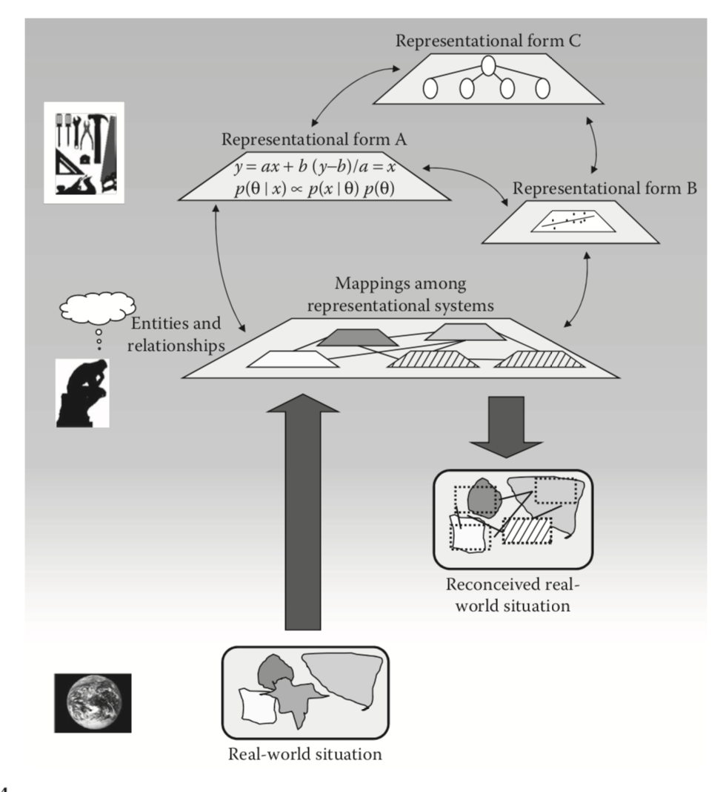
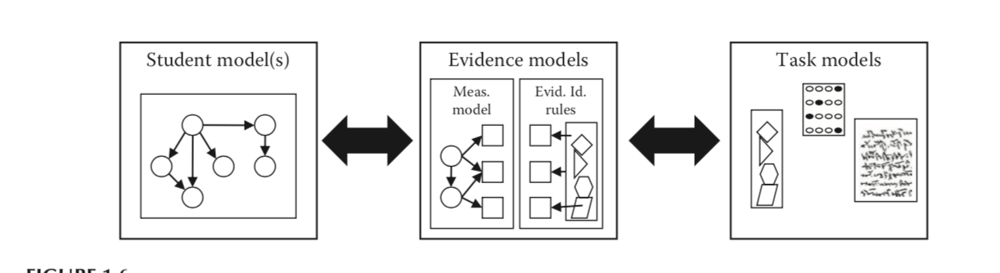

<!--
```{r setup, include=FALSE}
knitr::opts_chunk$set(echo = FALSE)
```
--> 

## Chapter 1: Overview of Assessment and Psychometric Modeling

- Chapter provides overview of challenges of assessment
- Assessment as Evidentiary Reasoning
    - Purpose of assessment $\rightarrow$ Inferring traits of people based on their behaviors
    - Making predictions/conclusions about what is unknown from what is known 
- Another way to summarize chapter: Logic underlying assessment


## Toulmin Diagrams



## Reasoning with Bayesian Statistics

- Bayesian statistics brings about probabilistic statements into logic of reasoning
    - Chances of being right/wrong about events
    - Quantification of uncertainty
- Models are the link between evidence and prediction
- Side note about comment on p. 11

> We adopt a philosophical position that asserts that our models are necessarily wrong, though hopefully useful. This sentiment, most closely associated with George Box (1976, 1979, Box  & Draper, 1987), has been widely rein- forced throughout the statistical literature (e.g., Freedman, 1987; Gelman & Shalizi, 2013), as well as the literatures associated with different psychometric modeling paradigms (e.g., Edwards, 2013; MacCallum, 2003; McDonald, 2010; Preacher, 2006; Thissen, 2001). 

## Model-based Reasoning 



## Epistemic Probability

- Levy and Mislevy note they follow epistemic interpretation of probability 
    - Siri says: Epistemic: relating to knowledge or to the degree of its validation
    - Other words: Probability represents beliefs (knowledge) about uncertainty
- Frequentist approach is based on long-run relative frequencies
    - Not entirely counter to epistemic probability 
    
## Evidence-Centered Design

- ECD: A way of understanding the argumentation behind the use of models 


