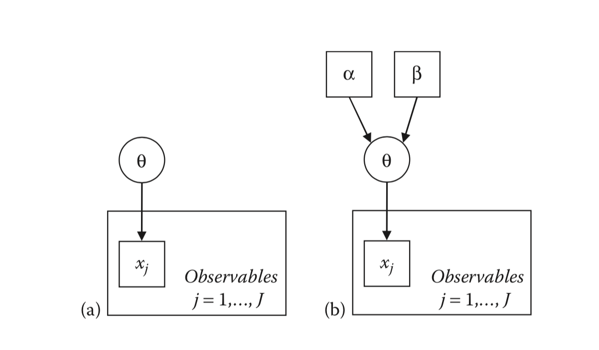

<!-- Replace output: line in header with these for different formatting options: -->
<!-- output: slidy_presentation --> 
<!-- output: beamer_presentation --> 
<!-- output: ioslides_presentation --> 

<!--
```{r setup, include=FALSE}
knitr::opts_chunk$set(echo = FALSE)
```
--> 

## Highlights of Chapter

- Principles of Bayesian methods for psychometric models
- Comparisons with maximum likelihood methods

## Review of Frequentist Inference with Maximum Likelihood

- Notation:
    - $\mathbf{x}$ represents data
    - $\boldsymbol{\theta}$ represents model parameters
    - $p \left(\mathbf{x} \mid \boldsymbol{\theta} \right)$ is the conditional distribution of data given model parameters
    - $L \left(\boldsymbol{\theta} \mid  \mathbf{x} \right) = p \left(\mathbf{x} \mid \boldsymbol{\theta} \right)$ is the likelihood function
  


The likelihood function in ML is equal to the conditional distribution of data given model parameters in Bayesian
    - Expresses that in ML, once data are observed, they are treated as known

$$L \left(\boldsymbol{\theta} \mid  \mathbf{x} \right) = p \left(\mathbf{x} \mid \boldsymbol{\theta} \right)$$

## ML Specifics
- Data are random
- Parameters are fixed/known in ML
- "What are the values of the parameters that yield the highest probability of observing the values of data that were observed"
- The ML estimator is a function of the data
    - With the data having a distribution, the ML estimator is now a random variable
- Standard errors give uncertainty in estimates
- Asymptotic theory gives rise to calculations of:
    - Parameter estimates
    - Standard errors
    - The assumed shape of the sampling distributions of parameters
    - The test distribution for parameters
    - The confidence intervals for parameters
    
## ML Philosophy
- Parameter point estimates, SEs, and confidence intervals are fixed, not random
    - Cannot be discussed probabilistically 
- Probability (or uncertainty) enters when talking about repeated sampling of the data
- Statements of uncertainty refer to the parameter estimator, not the parameter itself
  - Supports deductive arguments from parameters (general) to the data (particulars)
  - Does not support inductive arguments from data (particulars) to general (parameters)
  
## Bayesian Specifics
- Key is that $L \left(\boldsymbol{\theta} \mid  \mathbf{x} \right) = p \left(\mathbf{x} \mid \boldsymbol{\theta} \right)$
    - Likelihood function is central to Bayesian estimation
- Treats all parameters as random
- Model parameters are assigned prior distributions
    - Prior distributions are statements of uncertainty 
- Posterior distribution is blend of prior and likelihood

## Bernoulli and Binomial Models

### First, Bernoulli: 
Imagine $J$ independent and identically distributed Bernoulli random variables $\mathbf{x} = \left(x_1, \ldots, x_J \right)$, each with probability parameter $\theta$.

Conditional distribution of the data given the parameter for any one variable $j$: 

$$p\left( x_j \mid \theta \right) = \theta^{x_j}\left(1-\theta\right)^{1-x_j}$$
Conditional distribution of the sample $\mathbf{x}$: 

$$p\left( \mathbf{x} \mid \theta \right) = \prod_{j=1}^{J} p\left( x_j \mid \theta \right) = \prod_{j=1}^{J} \theta^{x_j}\left(1-\theta\right)^{1-x_j}$$
### Binomial

Let $y = \sum_{j=1}^J x_j$ be the number of 1s in $\mathbf{x}$ 

The conditional distribution of $y$ given $\theta$ and $J$ is a binomial:

$$p \left(y \mid \theta, J \right) = {J \choose y} \theta^y\left(1-\theta \right)^{J-y}$$ 
    
## Now, the data

Suppose $y = 7$ and $J=10$. Let's compare ML vs. Bayesian

We could derive the MLE for $\theta$ and find that it is:

$\renewcommand{\hat}[1]{\widehat{#1}}$ <!-- needed to fix hat display on some browsers -->
$$\hat{\theta} = \frac{y}{J}$$

## Analysis with ML:

Under ML, we know that the MLE for $\theta$ is $.7$. We can plot the likelihood function $L(\theta \mid y) = p \left(y \mid \theta, J \right)$ an confirm this: 

```{r likelihood, echo=TRUE}
plot(x = seq(0.001,.999,.001), y = dbinom(x = 7, size = 10, prob =  seq(0.001,.999,.001)), type = "l", xlab = expression(theta), ylab = expression(paste("p(y|", theta, ",J)")))
lines(x = c(.7,.7), y=c(0,dbinom(x = 7, size = 10, prob = .7)), lty = 2)
```
  
## Analysis with Bayesian:

For a Bayesian analysis, we need to plot the posterior distribution, or $p \left(\theta \mid y, J \right) \propto p\left(y \mid \theta, J \right) p\left(\theta\right)$. 

To do so, we must pick a prior distribution for $\theta$, or $p\left(\theta \right)$. I argue that finding good priors is difficult and not made any easier by example analyses like this one. But, we'll continue. 

Let's pick a distribution with the same sample space (or support; range of values for the data) that $\theta$ has. One such distribution is the uniform distribution. However, the uniform distribution doesn't make calculations of the posterior very easy (but...we could use one!). Instead, we will use a beta distribution, or $\theta \sim Beta\left( \alpha, \beta \right)$. You can change `alpha` and `beta` below to alter the shape

```{r prior, echo=TRUE}
alpha = 6
beta = 6
x = seq(.001, .999, .001)
y = dbeta(x = x, shape1 = alpha, shape2 = beta)
plot(x = x, y = y, type = "l", xlab = expression(theta), ylab = expression(paste("p(", theta, ")")))

```

With the Beta distribution as a prior, it turns out the posterior is also a Beta distribution, making it a *conjugate* prior. 

The posterior is then: 

$$ p \left(\theta \mid y, J \right) = Beta \left( \theta \mid y + \alpha, J - y + \beta \right)$$

```{r posterior, echo=TRUE}
y = 7
J = 10
priorAlpha = 1
priorBeta = 1

posteriorAlpha = y + priorAlpha
posteriorBeta = J - y + priorBeta

xCoord = seq(.001, .999, .001)
yCoord = dbeta(x = xCoord, shape1 = posteriorAlpha, shape2 = posteriorBeta)

mapEstimate = xCoord[which(yCoord==max(yCoord))]
posteriorMode = (posteriorAlpha - 1)/(posteriorAlpha + posteriorBeta - 2)
posteriorMean = (posteriorAlpha)/(posteriorAlpha + posteriorBeta)
posteriorVariance = (posteriorAlpha*posteriorBeta)/(((posteriorAlpha + posteriorBeta)^2)*(posteriorAlpha + posteriorBeta + 1))
posteriorSD = sqrt(posteriorVariance)

plot(x = xCoord, y = yCoord, type = "l", xlab = expression(theta), 
     ylab = expression(paste("p(", theta, ")")), main = paste("Red = MAP = ", round(x = mapEstimate, digits = 2), 
                                                              "; Green = EAP = ", round(x = posteriorMean, digits = 2),
                                                              "; SD = ", round(x = posteriorSD, digits = 2)))
lines(x = c(mapEstimate, mapEstimate), y = c(0, dbeta(x = mapEstimate, shape1 = posteriorAlpha, shape2 = posteriorBeta)), lty = 2, col=2)
lines(x = c(posteriorMean, posteriorMean), y = c(0, dbeta(x = posteriorMean, shape1 = posteriorAlpha, shape2 = posteriorBeta)), lty = 2, col=3)

```

## Comparison of all Three Functions: Prior, Likelihood, and Posterior

Now, lets put all functions onto the same plot to compare: Prior, Posterior, and Likelihood

```{r posterior-prior-ML, echo=TRUE}
y = 7
J = 10
priorAlpha = 6
priorBeta = 6

posteriorAlpha = y + priorAlpha
posteriorBeta = J - y + priorBeta

xCoord = seq(.001, .999, .001)
yCoordLikelihood = dbinom(x = 7, size = 10, prob =  xCoord)
yCoordPosterior = dbeta(x = xCoord, shape1 = posteriorAlpha, shape2 = posteriorBeta)
yCoordPrior = dbeta(x = xCoord, shape1 = priorAlpha, shape2 = priorBeta)

mapEstimate = xCoord[which(yCoord==max(yCoord))]
posteriorMode = (posteriorAlpha - 1)/(posteriorAlpha + posteriorBeta - 2)
posteriorMean = (posteriorAlpha)/(posteriorAlpha + posteriorBeta)
posteriorVariance = (posteriorAlpha*posteriorBeta)/(((posteriorAlpha + posteriorBeta)^2)*(posteriorAlpha + posteriorBeta + 1))
posteriorSD = sqrt(posteriorVariance)

yMat = cbind(yCoordPrior, yCoordLikelihood, yCoordPosterior)
xMat = cbind(xCoord, xCoord, xCoord)

matplot(x = xMat, y = yMat, type = "l", xlab = expression(theta), 
     ylab = expression(paste("p(", theta, ")")), main = paste("Red = MAP = ", round(x = mapEstimate, digits = 2), 
                                                              "; Green = EAP = ", round(x = posteriorMean, digits = 2),
                                                              "; SD = ", round(x = posteriorSD, digits = 2)),
     lwd = 3)
legend(x = 0, y = 1, legend = c("Prior", "Likelihood", "Posterior"), col = 1:3, lty = 1:3, lwd = 1:3)
```


## Summarzing Posterior Distributions

Once the posterior distribution has been obtained, summaries of it can be used for inference
- Central tendency:
    - Posterior mean (Expected A Posteriori)
    - Posterior mode (Maximum A Posteriori)
    - Posterior median (less often)
- Note: Not all posterior distributions are symmetric (so using more than one summary is important)
    - Also, some may be multimodal
    
- Measures of variability:
    - Posterior variance/SD
    - Interval Summaries:
        - Credible interval (CI) -- based on percentiles of the posterior distribution 
        - Highest posterior density (HPD) -- CI with shortest distance between upper and lower bound
        
With our Beta distribution, each of these can be obtained using the moments or the CDF

With MCMC, we'll use brute force to summarize the posterior distribution

## Graphical Model Representation

Often, Bayesian models are represented in a graphical model
- Common type: Directed Acyclic Graph
    - Graph: A picture made of
        - Nodes: Variables
        - Edges: Relations between variables (X -> Y means node X predicts node Y)
    - Directed: All relations are directional (some variation about edges with two arrows)
    - Acyclic: No cycles present in a graph
    
There are any number of types of DAGs, and many Bayesians use differing types.

Two that are useful when initially setting up a Bayesian Model in syntax are given in Figure 2.7:



The graph on the left omits the parameters of the prior distribution of $\theta$ whereas they are added on the right. 

Several things to note:

- The shapes of the nodes are context-specific (they will change by what the graph depicts)
- The large squares with "Observables" are "plates" -- these can represent graphs with different units of sampling
    - e.g., Items within people; People within groups
    
Because of the contextual differences in graphs, some statements made about this graph aren't true of others. The following statement is true for the graphs above, but not true for all graphs (think CFA/IRT)

> It however these entities are themselves unknown (i.e., they are circles), they must have parents. This process of adding layers of parents continues until the only remaining entities are known values (rectangles). (p. 38)


