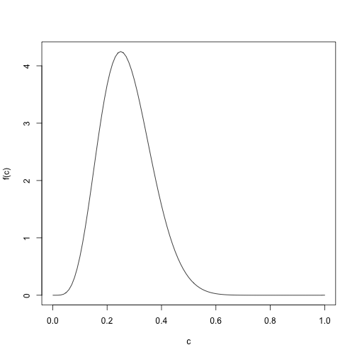

Bayesian Item Response Modeling for Binary Data
========================================================
author: Jonathan Templin
date: Friday, April 12, 2019
autosize: true

Today's Class
========================================================

Estimating Common Binary Item Response Models with MCMC
- Comparisons to CFA
- Model Parameterizations
- Unidimensional and Multidimensional Models 

Unidimensional IRT Models for Binary Data
========================================================

The Four-Parameter Logistic Model:

$$P \left(X_{pi} = 1 \mid  \theta_p \right) = c_i + \left(d_i - c_i\right)\frac{\exp\left(a_i\left(\theta_p - b_i \right) \right)}{1+ \exp\left(a_i\left(\theta_p - b_i \right) \right)} $$ 

<!-- = \left(1+ \exp\left(-a_i\left(\theta_p - b_i \right) \right)\right)^{-1}$$ -->
Here:
- $a_i$ is item discrimination 
    - Range: $(-\infty, \infty)$; often thought to be $[0, \infty)$
- $b_i$ is item difficulty 
    - Range: $(-\infty, \infty)$
- $c_i$ is lower asymptote
    - Range: $[0, 1]$
- $d_i$ is upper asymptote
    - Range: $[0, 1]$
- $\theta_p \sim N\left(\mu_\theta, \sigma^2_\theta \right)$ 

Binary IRT Model Structural Model Configurations
========================================================

Structural Model:
- Latent mean: 
  - $\mu_\theta$ = 0 and all $b_i$ estimated, or 
  - $\mu_\theta$ estimated and at least one $b_i$ not estimated
    - $b_i$ constraints:
      - Marker item: set one $b_i=0$
      - Sum-to-zero: set $b_{i'} = -\sum_{i \neq i'} b_i$
- Latent variance: 
  - $\sigma^2_\theta = 1$ and all $a_i$ estimated, or 
  - $\sigma^2_\theta$ estimated and at least one $a_i$ not estimated
  - $a_i$ constraints:
      - Marker item: set one $a_i=0$
      - Sum-to-zero: set $a_{i'} = -\sum_{i \neq i'} a_i$
  
Binary IRT Model Measurement Model Configurations
========================================================

- 1PL ($\forall i$): $c_i =0$, $d_i = 1$, plus $[a_i = a ; \sigma^2_\theta = 1]$ or $[a_i = 1; \sigma^2_\theta$ estimated $]$, latent mean plus number of estimated difficulties must equal number of items
- 2PL ($\forall i$): $c_i =0$, $d_i = 1$, latent variance plus number of estimated discriminations must equal number of items, latent mean plus number of estimated difficulties must equal number of items
- 3PL ($\forall i$): $d_i = 1$, latent variance plus number of estimated discriminations must equal number of items, latent mean plus number of estimated difficulties must equal number of items
- 4PL ($\forall i$): latent variance plus number of estimated discriminations must equal number of items, latent mean plus number of estimated difficulties must equal number of items

Additional Parameterizations: Link Functions
========================================================

The choice of link function for core: $a_i\left(\theta_p - b_i \right)$

- Inverse logit link function (converts core to probability):
$$\frac{\exp\left(a_i\left(\theta_p - b_i \right) \right)}{1+ \exp\left(a_i\left(\theta_p - b_i \right) \right)}$$

- Inverse normal ogive link function (converts core to probability):
$$\Phi^{-1}\left( a_i\left(\theta_p - b_i \right)\right)$$

where 
$$\Phi^{-1}\left(z \right) = \int_{-\infty}^z \frac{1}{\sqrt{2\pi}}\exp\left(\frac{-x^2}{2} \right) dx$$


Additional Parameterizations: Slope/Intercept Core
========================================================

The IRT model core $a_i\left(\theta_p - b_i \right)$ can be reparameterized as

$$\mu_i + \lambda_i \theta_i,$$

Which comes from multiplying $a_i$ through $\left(\theta_p - b_i \right)$:

$$a_i\left(\theta_p - b_i \right) = -a_ib_i + a_i\theta_i = \mu_i + \lambda_i\theta_i$$

Where,

- $\lambda_i = a_i$
- $\mu_i = -a_ib_i$, leading to $b_i = -\frac{\mu_i}{a_i} = -\frac{\mu_i}{\lambda_i}$

Of note, one can always convert one model parameterization to the other
- But, depending on prior selection, it is not guaranteed that the posterior distributions will be identical

Bayes-ifying the IRT Model
========================================================

To estimate the Bayesian version of the IRT model, we must specify:

1.  The model-data likelihood function
2.  Prior distributions for all parameters

Model Data Likelihood
========================================================

The IRT model-data likelihood for a binary item $i$ and person $p$:

$$X_{pi}\mid \theta_p \sim Bernoulli\left(P_{pi}\right)$$

Where $P_{pi}$ is $P \left(X_{pi} = 1 \mid  \theta_p \right)$, and

$$f\left(X_{pi} \mid \theta_p \right) = P_{pi}^{X_{pi}} \left(1-P_{pi}\right)^{1-X_{pi}}$$

- The JAGS syntax for the model portion will use the `dbern(prob)` function where prob is $P_{pi}$ (replace the `_____` I put in the command below)


```r
" # model-data likelihood step
    for (person in 1:N){
      for (item in 1:I){
        X[person, item] ~ dbern(_____)    
      }
    }
"
```

Model Data Likelihood: Slope/Intercept
========================================================

For unidimensional models with the __logit link function__ and in __slope/intercept__ form, the model-data likelihood looks like:


```r
" # model-data likelihood step
    for (person in 1:N){
      for (item in 1:I){
        X[person, item] ~ dbern(c[item] + (d[item]-c[item])*(1/(1+exp(-1*(mu[item] + lambda[item]*theta[person])))))    
      }
    }
"
```

For unidimensional models with the __probit link function__ and in __slope/intercept__ form, the model-data likelihood looks like:


```r
" # model-data likelihood step
    for (person in 1:N){
      for (item in 1:I){
        X[person, item] ~ dbern(c[item] + (d[item]-c[item])*phi(mu[item] + lambda[item]*theta[person]))
      }
    }
"
```

Model Data Likelihood: Discrimination/Difficulty
========================================================

For unidimensional models with the __logit link function__ and in __discrimination/difficulty__ form, the model-data likelihood looks like:


```r
" # model-data likelihood step
    for (person in 1:N){
      for (item in 1:I){
        X[person, item] ~ dbern(c[item] + (d[item]-c[item])*(1/(1+exp(-1*(a[item]*(theta[person]-b[item]))))))    
      }
    }
"
```

For unidimensional models with the __probit link function__ and in  __discrimination/difficulty__ form, the model-data likelihood looks like:


```r
" # model-data likelihood step
    for (person in 1:N){
      for (item in 1:I){
        X[person, item] ~ dbern(c[item] + (d[item]-c[item])*phi(a[item]*(theta[person]-b[item])))
      }
    }
"
```

Prior Distributions: Ability Parameter
========================================================

After the model-data likelihood, the next step is to create the prior distributions.

For $\theta_p$, biggest decision is choice of scale identification

-  Standardized mean/variance for $\theta_p$ (fixes mean to zero and variance to one), $\theta_p \sim N(0,1)$:

```r
" 
    for (person in 1:N){
      theta[person] ~ dnorm(0, 1)
    }
"
```

Here, no other parameters are needed as the structural model (the part after `~` has fixed values)

Prior Distributions: Ability Parameter
========================================================

For $\theta_p$, biggest decision is choice of scale identification

- Standardized mean/estimated variance for $\theta_p$ (fixes mean to zero, estimates variance; at least one constraint on discrimination/loading parameters): $\theta_p \sim N(0, \sigma^2_\theta)$


```r
" 
    for (person in 1:N){
      theta[person] ~ dnorm(0, inv.sigma2.theta)
    }
    inv.sigma2.theta ~ dgamma(inv.sigma2.theta.alpha0, inv.sigma2.theta.beta0)
"
```

Prior Distributions: Ability Parameter
========================================================
- For estimating the variance, JAGS models $1/\sigma^2_\theta$ so weneed to specify prior for hyper parameter $1/\sigma^2_\theta$, often using `dgamma(alpha, beta)`
- It is hard to determine good priors for $\frac{1}{\sigma^2_\theta}$: 
    - We can set inv.sigma2.theta.alpha0 to be .5 times expected variance of $\theta_p$
    - We can set inv.sigma2.theta.beta0 to be .5 times 1 (the analog to expected degrees of freedom)
    - If chain has difficulty converging, we may have to increase expected degrees of freedom
    
Prior Distributions: Ability Parameter
========================================================

For $\theta_p$, biggest decision is choice of scale identification

- Estimated mean/estimated variance for $\theta_p$ (estimates mean, estimates variance; at least one constraint on discrimination/loading parameters and one constraint on item intercepts/difficulty parameters): $\theta_p \sim N(\mu_\theta, \sigma^2_\theta)$


```r
" 
    for (person in 1:N){
      theta[person] ~ dnorm(mean.theta, inv.sigma2.theta)
    }
    inv.sigma2.theta ~ dgamma(inv.sigma2.theta.alpha0, inv.sigma2.theta.beta0)
    mean.theta ~ dnorm(mean.theta0, precision.mean.theta0)
"
```

Prior Distributions: Ability Parameter
========================================================
- For estimating the mean of $\theta$, we can use a normal distribution and `dnorm(mean, precision)`
- Can set uninformative priors for $\mu_{\theta}$
    - We can set mean.theta0 to be 0 (or some value of the expected mean)
    - We can set precision.mean.theta to be very small (one over large variance)

Prior Distributions: Discrimination/Loading Parameters
========================================================
- In the IRT literature, we often see these set to positive values using either a log-normal prior...


```r
" 
    for (item in 1:N){
      a[item] ~ dlnorm(mean.a0, precision.a0)
    }
    
"
```

Prior Distributions: Discrimination/Loading Parameters
========================================================
...Or a truncated normal prior...

```r
" 
    for (item in 1:N){
      a[item] ~ dnorm(mean.a0, precision.a0)T(0,)
    }
    
"
```

Prior Distributions: Discrimination/Loading Parameters
========================================================

...but, I prefer an unrestricted prior allowing these to be negative:

```r
" 
    for (item in 1:N){
      a[item] ~ dnorm(mean.a0, precision.a0)
    }
    
"
```

Prior Distributions: Difficulty Parameters
========================================================
In the discrimination/difficulty parameterization, the
difficulty parameters are often given a normal prior with a zero mean and a small precision


```r
" 
    for (item in 1:N){
      b[item] ~ dnorm(mean.b0, precision.b0)
    }
    
"
```

Prior Distributions: Item Intercept Parameters
========================================================
In the slope/intercept parameterization, the
intercept parameters are often given a normal prior with a zero mean and a small precision


```r
" 
    for (item in 1:N){
      mu[item] ~ dnorm(mean.mu0, precision.mu0)
    }
    
"
```

Prior Distributions: Lower Asymptote Parameters
========================================================

- The lower asymptote parameter ranges from zero to one
- No conjugate priors are available
- A common choice for prior is the Beta(a, b) distribution
    - Here, a common choice for hyper-parameters are values that make the mode of the prior equal to what chance guessing $p$ would be for multiple choice items (otherwise a small value)
    - BILOG set this so that $a=20p+1$ and $b=20(1-p)+1$




Prior Distributions: Lower Asymptote Parameters
========================================================

Syntax for JAGS is:

```r
" 
    for (item in 1:N){
      c[item] ~ dbeta(a.c0, b.c0)
    }
    
"
```

Prior Distributions: Upper Asymptote Parameters
========================================================

No real advice has been given for upper asymptote parameters, but beta distributions are often used.


```r
" 
    for (item in 1:N){
      d[item] ~ dbeta(a.d0, b.d0)
    }
    
"
```

Example Analyses
========================================================

See bpm19psqf7375_Lecture11.R for example analyses
- Note: the example syntax does not include the analysis as it takes a long time to run but does save the analysis


Multidimensional IRT Models
========================================================

The Four-Parameter Multidimensional Logistic Model:

$$P \left(X_{pi} = 1 \mid  \theta_p \right) = c_i + \left(d_i - c_i\right)\frac{\exp\left( \mu_i + \boldsymbol{\Lambda}_i \boldsymbol{\Theta}_p \right)}{1+ \exp\left( \mu_i + \boldsymbol{\Lambda}_i \boldsymbol{\Theta}_p \right)} $$ 

- $\boldsymbol{\Lambda}_i$ is vector of item slopes/discriminations 
    - Range: $(-\infty, \infty)$; often thought to be $[0, \infty)$
- $mu_i$ is item intercept 
    - Range: $(-\infty, \infty)$
- $c_i$ is lower asymptote
    - Range: $[0, 1]$
- $d_i$ is upper asymptote
    - Range: $[0, 1]$
- $\boldsymbol{\Theta}_p \sim N\left(\boldsymbol{\mu}_\theta, \boldsymbol{\Sigma}_\theta \right)$ 
